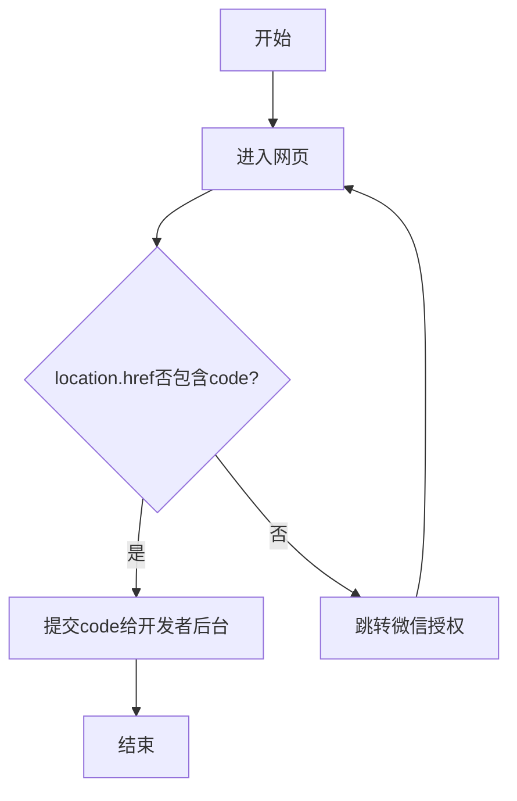

# 微信登录授权处理

参考[网页授权](https://developers.weixin.qq.com/doc/offiaccount/OA_Web_Apps/Wechat_webpage_authorization.html)



```ts
/**
 * @description 微信授权
 */
export function wxAuth() {
  // 当前地址
  const currentUrl = new URL(window.location.href)
  // 参数
  const state = currentUrl.searchParams.get('state') ?? 'state'

  const appid = import.meta.env.VITE_APP_WX_APP_ID

  const redirect_uri = currentUrl.href

  const wxAuthUrl = new URL('https://open.weixin.qq.com/connect/oauth2/authorize')
  wxAuthUrl.searchParams.set('appid', appid)
  wxAuthUrl.searchParams.set('redirect_uri', redirect_uri)
  wxAuthUrl.searchParams.set('response_type', 'code')
  wxAuthUrl.searchParams.set('scope', 'snsapi_userinfo')
  wxAuthUrl.searchParams.set('state', state)
  wxAuthUrl.hash = 'wechat_redirect'

  window.location.href = wxAuthUrl.href
}
```
